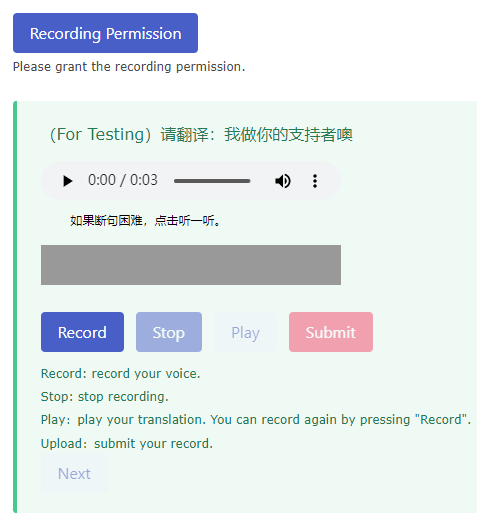

How to prepare dataset for training the model? 
=====

This blog will introduce how I prepare a website [PT-CS-Dataset](https://demo.guanyueli.com/model/pt_cs_translator) for collecting audio translations from Chaoshanese. The header will display the number of visitors and translations. By two days after the website was published, the header displayed that there were already 37 visitors and 431 translations, with every visitor donating about 20 translations on average.  

    
         
    
    

    Figure 2. Statistics of the website. The English version is used for PhD application. 
    

After inputting your basic personal information, you are encouraged to input your email to receive our advancement report of the project. The checkbox informs you whether you consent to make your translations open-source or not. If you consent to participate in the open-source dataset, then not only your translations would be used for training the model but also publicized as an open-source Chaoshanese ASR dataset. 

    
     
    

    Figure 3. Basic information of the user. 
    

The website requires you to grant recording permission for us, so you need to check if your PCs or smartphones are capable of recording. If the button becomes green after a click, you are ready to record and contribute to our dataset. 

The website will generate a random sentence for you to translate. You need to click the "Record" button before you can speak. You are required to speak fluently in a normal tone as if you were talking. You can use the "Play" button to preview your recording. The system allows you to record as many times as you like before submitting your final version. The first sentence is used for the user to get familiar with the UI so it won't be uploaded to the system. The system will upload your second and later sentences. Once you submit your translation, it will be uploaded to our dataset, and the system will return you the following sentence. You don't have to retype your information if you continue. Therefore I believe you will have a smooth recording experience. Usually, every donator records 20-50 translations on average. 

    
     
    

    Figure 2. Basic information of the user. 
    

About the dataset
========
I chose a Chinese Audio Speech Recognition (ASR) dataset [ST-CMDS](https://link.ailemon.net/?target=http://www.openslr.org/resources/38/ST-CMDS-20170001_1-OS.tar.gz) for my convenience. The dataset contains approximately 100 thousand sentences and the associate Chinese translations. Therefore, I can use the sentences to prompt users to upload their Chaoshanese translations. 

About the website
========
The website is based on [gunicorn](https://gunicorn.org/) for it's developed in Python environment. Gunicorn enables simple implementation, light server dependencies and fairly speediness. 

About the User Interface Design
=======
I used the [Bulma](https://bulma.io/) as my CSS framework that renders beautiful and user-friendly UI design. Bulma is a free, open-source framework that provides ready-to-use frontend components that you can easily combine to build responsive web interfaces. 

About the Database
=======
I used the [sqlite3]() as the database for storing the paths of uploaded translations. Actually, sqlite3 help me manage the whole data structure for the translations. For example, I use the sqlite3 to keep track of the path of sentences and the translations as well. 

