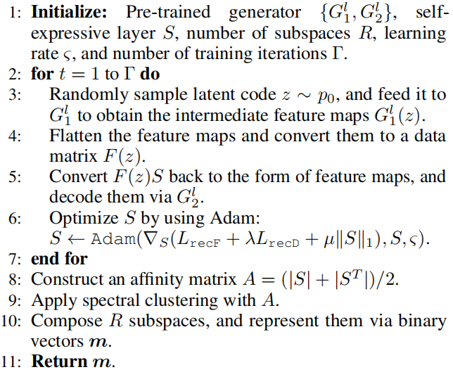

[[Download paper]](https://ojs.aaai.org/index.php/AAAI/article/view/17017), [[Github]](https://github.com/guanyuelee/PmSFC)

Problem Describtion
======
Generative Adversarial Networks (GANs) have achieved considerable success in high fidelity image synthesis and downstream applications, such as [PGGAN](https://arxiv.org/abs/1710.10196), [StyleGAN](https://openaccess.thecvf.com/content_CVPR_2019/html/Karras_A_Style-Based_Generator_Architecture_for_Generative_Adversarial_Networks_CVPR_2019_paper.html), [BigGAN](https://arxiv.org/abs/1809.11096) and so on. But GAN has no way to inference for the latent code, which leads to the development of GAN inversion in these years. GAN inversion aims to reverse a target image back to a code in the latent space such that the inverted code can be as close to the target image as possible. 

Formally speaking, given a pre-trained generator $G$ and a target image $x$, we are required to find an optimal latent code $z$, such that $x = G(z)$. In this paper, we mainly discuss the PGGAN-like or BigGAN-like pretrained generator which doesn't include style-like modules like StyleGAN. The target code $z$ could be optimized by Gradient Descent: 

$$\min_{z} \|x - G(z)\|^2_2 + \|V(x) - V(G(z))\|_1, \tag{1}$$ 

where $V$ denotes a pre-trained network for feature extraction. We show some inversion results from [Bau D., et al](http://ganseeing.csail.mit.edu/papers/seeing.pdf) in Figure 1. From the results, we can see that inversion result produces reasonable reconstruction because inversion images has similar semantical structure with the target images, but the inversion results are hardly satisfactory. You can refer to paper ([Bau D., et al](http://ganseeing.csail.mit.edu/papers/seeing.pdf)) for their deeper analysis on what GAN cannot generate. 

    
     
    

    Figure 1. Inversion results from Bau D., et al. 
    

As reported in [Gu J., et al](https://openaccess.thecvf.com/content_CVPR_2020/html/Gu_Image_Processing_Using_Multi-Code_GAN_Prior_CVPR_2020_paper.html), the expressiveness of a single latent code is less satisfactory for the case where the target image is out of the distribution of the GAN’s training data. In their model which is named mGANprior, multiple latent codes are used, and the corresponding intermediate feature maps are combined to improve the inversion performance. Formally speaking, they split the generator $G$ into two subnetworks along $l$-th layer: $G^l_1$ and $G^l_2$. The objective is to determine a set of latent codes $\textbf{z} = {z_1, z_2, \cdots, z_K}$ and a set of weighting vectors $\textbf{w} = {w_1, w_2, \cdots, w_K}$ for image reconstruction as follows:

$$\tilde{x}=G^l_2\left( \sum_{k=1}^{K}G_1^l(z_k)\odot w_k \right),\tag{2}$$
where the dimension of $w_k$ is the same as the number of channels, and the operation $\odot$ represents channel-wise multiplication.  To ensure the consistency between the original input and the reconstruction at both low and high levels, the optimization problem is defined as follows:

$$\min_{\textbf{z},\textbf{w}} \|x - \tilde{x}\|^2_2 + \|V(x) - V(\tilde{x})\|_1. \tag{3}$$ 
The most different part between equation $(1)$ and $(3)$ are the parameters to be optimized. In eqation $(1)$, only 1 latent code is optimized, while there are $K$ latent codes and $K$ mixing weights to be optimized in equation $(3)$. We show our implementation of mGANprior in Figure 2. We can see that Gu J., et al only regress to original image in the pixel-wise level instead of in semantic level, and also the results are also blurry. 

<table>
    <tr>
        <td>
            

            
             
            

            (a) CelebA-HQ results
            

            

        </td>
        <td>
            

            
             
            

            (b) LSUB-Bedroom results
            

            

        </td>
    </tr>
</table>

    Figure 2. Inversion results comparison between Gu J., et al (right) and original images (left). We use the official published implementation. Opening the image in new page is encouraging. 
    

Our Ideas
======
Now let's look at our ideas to handle this problem. The idea is **looking for an image in a generator is like looking for a character in a dictionary**, and we show our ideas in the Figure 3. Traditional inversion methods are like brute-force searching a character page to page. But there is a much more efficient way which everyone of us was learned when we were in primary school --- searching by index. For example, Chinese character "tree" can be divided into 3 parts. And we can search for the main part first because it is much easier and faster than searching for the whole. And then we keep search for the second part, the third part, and we finally get the target character in just 3 indexings. For GAN inversion and take find a target face as an example, we aim to search for the closest hair style, color, background and mouth instead of seraching for the whole from scratch. Does it sound promising? If yes, the next problem would be how to find a way to search for the closest hair style, color, etc? In this work, we proposed a new term in GAN: **Subspace**. 

    
     
    

    Figure 3. 
    <i>"Looking for an image in a generator is like looking for a character in a dictionary."</i> 
    

Subspace
------
In pre-trained generator, there are correlationship between channels in the intermediate layer. In order to analyze the relationship among the intermediate feature channels of $G$, we incorporate an additional self-expressive layer between $G_1^l$ and $G^l_2$. We aim to discover a number of meaningful subspaces, in which each channel can be represented as a linear combination of other channels. To facilitate GAN inversion, our strategy is to perform feature composition in different subspaces, such that the inversion process is regularized based on different aspects of semantics. The diagram is shown as follows: 

    
     
    

    Figure 4. Diagram of subspace discovery. 
    

Specifically, We flatten each feature map of $G_1^l(z)$ into a vector, and stack all the vectors into columns of a matrix $F(z)$. To explore self-expressiveness characteristics of the feature channels, a coefficient matrix $S$ is learnt to ensure that $F(z) = F(z)S$, and we thus define a reconstruction loss as follows:

$$L_{recF}=\mathbb{E}_{z \sim p_0}[\|F(z) - F(z)S\|^2_2], \tag{4}$$

where $p_0$ denotes a prior distribution of latent codes. We find that minimizing LrecF is not enough to ensure semantic consistency after decoding $F(z)$ and $F(z)S$. Small reconstruction errors in the intermediate feature space may lead to significant visual differences. To avoid this situation, we define another reconstruction loss in the data space as follows: 

$$L_{recD}=\mathbb{E}_{z \sim p_0}[\|G_2^l(G_1^l(z)) - G_2^l(\mathcal{T}(F(z)S))\|^2_2], \tag{5}$$

where $\mathcal{T}(\cdot)$ denotes a transformation to reverse the flattening operation, such that the output has the same dimensions as the original feature maps.

On the other hand, $S$ is expected to have a block-diagonal structure to some extent, such that the encoded subspaces will be more separable. After including a sparsity regularizer on $S$, the optimization of the self-expressive layer is formulated as follows: 

$$\min_S L_{recF} + \lambda L_{recD} + \mu \|S\|_1 \quad s.t. \quad diag(S)=0, \tag{6}$$

where $\lambda$ and $\mu$ are weighting factors for adjusting the relative importance of the corresponding terms. Note that there is a trivial solution ($S = I$), and we thus require that $diag(S) = 0$. The self-expressive layer can be implemented via the full connection of size $C \times C$ without applying bias and nonlinear activations, where $C$ denotes the number of channels and each feature channel is taken as a node. Based on the resulting $S$, we construct an affinity matrix $A$ as $A = (|S| + |S^T|)/2$, and apply the spectral clustering algorithm [(Ng, Jordan, and Weiss 2002)](https://proceedings.neurips.cc/paper/2001/file/801272ee79cfde7fa5960571fee36b9b-Paper.pdf) to determine a set of subspaces over the intermediate feature channels. We outline the training procedure of the proposed subspace discovery approach in Algorithm 1:

    
     
    

    Algorithm 1. Pseudo-code of subspace discovery over GAN's intermediate feature channels. 
    

PmSFC
------
We are going to corperate subspace into GAN inversion. We partition the intermediate feature channels into $R$ subspaces for GAN inversion, and the resulting subspaces can be represented by $\textbf{m} = {m_1, m_2, \cdots, m_R}$, where $m_r \in \{0, 1\}^C$ denotes a binary indicator vector for the rth subspace. The component $m_r(c)$ is set to either 1 or 0, which corresponses to whether the $c$-th feature channel is selected or not.

To reconstruct the original image $x$, we assign multiple latent codes $\textbf{z}^r = \{z^r_1, z^r_2, · · · , z^r_K\}$ for each subspace, and each latent code $z^r_k$ is also associated with a weighting vector $w^r_k$. In the rth subspace, we combine the intermediate features as follows:

$$\textbf{f}^r =\frac{\sum_{k=1}^{K} (m^r\odot G_1^l(z_k^r))\odot \sigma(w_k^r)}{\sum_{k=1}^{K}\sigma (w^r_k)}, \tag{7}$$

where $\sigma$ denotes the activation function $tanh(\cdot)$ to regularize the weights into the range of (-1, 1). We consider that different subspaces are associated with different visual concepts, and image reconstruction can thus be improved when combining the corresponding feature maps composed in the subspaces. Toward this end, the original image is approximated as follows:

$$\hat{x}=G_2^l(\texttt{re-order}(\textbf{f}^1,\textbf{f}^2, \cdots, \textbf{f}^R)), \tag{8}$$

where $\texttt{re-order}(\cdot)$ represents an operation to place the feature maps according to the inherent channel order of $G^l_1$. To ensure the consistency between the original and reconstructed images at both pixel-level and perceptual-level, we formulate the corresponding optimization problem as follows:

$$\min_{\{\textbf{z}^r\}_{r=1}^{R},\{\textbf{w}^r\}_{r=1}^{R}} \|x-\hat{x}\|^2_2 + \|V(x)-V(\hat{x})\|_1. \tag{9}$$

The diagram is shown as follows: 

    
     
    

    Figure 5. The diagram of discovering subspace and inverting image by PmSFC. 
    

Experiments
======
How to check the subspace we discovered in the pre-trained generator? we specify a subspace, and exchange the corresponding feature maps of the paired images. The second
subnetwork $G^l_2$ is used to decode the resulting features. As shown in Figure 6, we find that the obtained subspaces control meaningful attributes, such as expression, age, color and weather. Note that we discover subspaces over intermediate feature channels without a disentangling process, since the generator is frozen during training.

    
     
    

    Figure 6. Examples of exchanging feature maps in the subspaces associated with different attributes: expression (top left), age (top right), color (bottom left), and weather (bottom right). In each example, diagonal images are the inversion results. 
    

 Figure 7 shows a number of the inverted images by mGANprior and our PmSFC. Note that mGANprior is implemented in our configuration according to the open-source code. The zoomed-in regions highlight that the capability of PmSFC to restore more details of the target images. The results suggest that inclusion of subspaces over GAN’s intermediate feature channels enhances the inversion performance.

    
     
    

    Figure 7. Visual comparison of mGANprior and our PmSFC in GAN inversion. 
    

There are more analysis of our model PmSFC in our paper, please refer to our paper and github code for more information. We also encourage you to cite our paper: 

Recommended citation: Li, G., Jiao, Q., Qian, S., Wu, S., & Wong, H. S. (2021, May). High Fidelity GAN Inversion via Prior Multi-Subspace Feature Composition. <i>In Proceedings of the AAAI Conference on Artificial Intelligence </i> (Vol. 35, No. 9, pp. 8366-8374). 

<body>

    Author: Guanyue Li. Copy Right Reserved.  

</body>