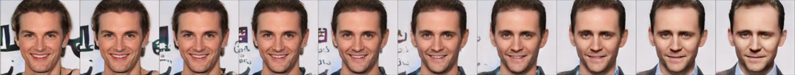
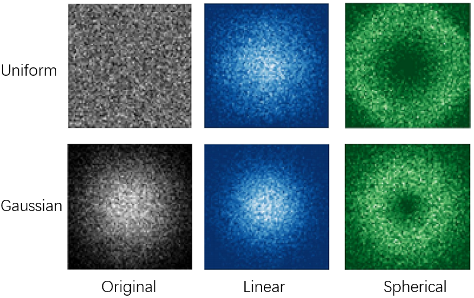
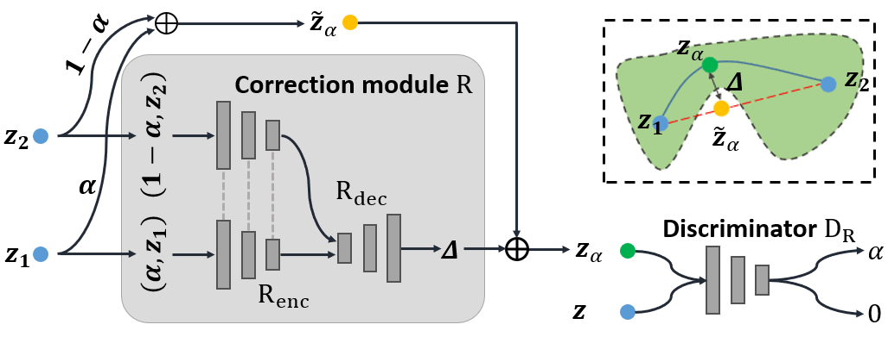
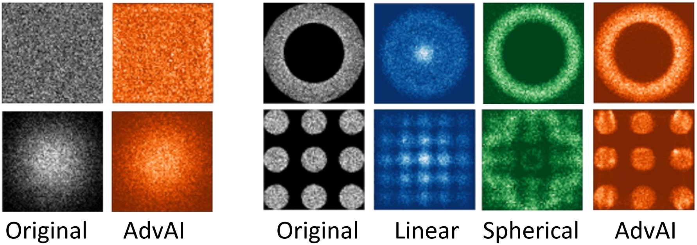
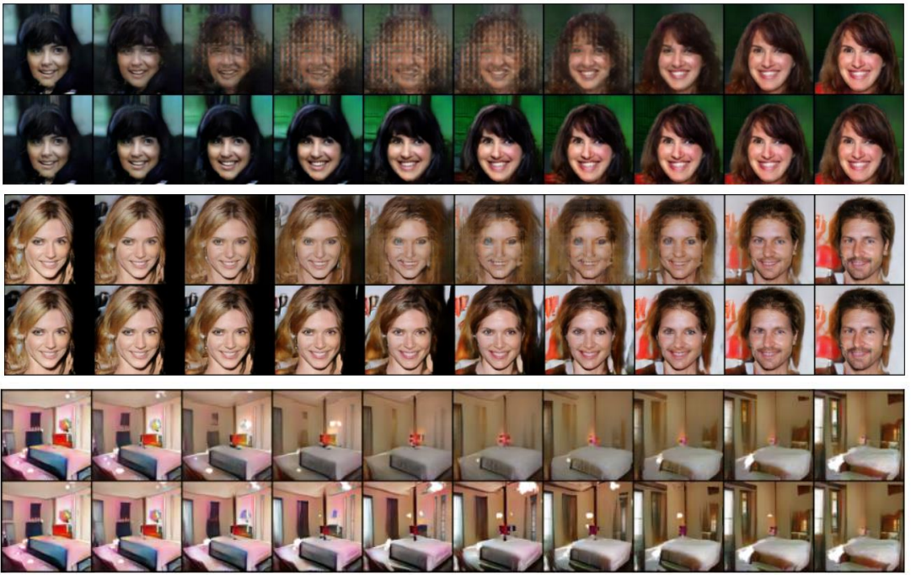

[[Download]](https://ieeexplore.ieee.org/abstract/document/9428311), [[Github]](https://github.com/guanyuelee/AdvAI)

----

If you are interested in followings: 
- How to interprete the latent space of GAN by interpolation?
- An amazing phenomenon that is neglected by most people. 

This paper is just suitable to you. Enjoy it!

Interpolation in GAN
======
There plenty of ways to interprete latent space of GAN, like [GAN inversion](https://guanyueli.com/publication/aaai2021), interpolation. In this paper, we are going to talk about interpolation and examine its property. 

    
     
    

    Figure 1. An interpolation diagram. Figure adapted from [1]. 
    

GAN is capable to out the distribution of real dataset. It's believed that if GAN learns the data manifold of real dataset, it learns semantics from the dataset instead of memorizing the dataset. Formally speaking, given a pre-trained generator $G$ and two randomly sampled noise $z_1$ and $z_2$, we can use interpolation to get the middle datapoint $z_\alpha=f(z_1, z_2, \alpha)$ by interpolation method $f$. There exist plenty of interpolation methods, and I will list them as follows: 
- Most commom interpolation --- linear interpolation: 
$$f(z_1, z_2, \alpha) = \alpha z_1 + (1-\alpha) z_2.$$
- Spherical interpolation: 
$$f(z_1, z_2, \alpha) = \frac{\sin((1-\alpha)\Theta)}{sin(\Theta)} z_1 + \frac{\sin(\alpha\Theta)}{sin(\Theta)} z_2.$$

You can use interpolation to generate a series of images by varying interpolation coefficient $\alpha$. For example, Figure 1 shows the interpolation path using [PGGAN](). 

    
     
    

    Figure 2. An interpolation path in PGGAN. 
    

Distribution Mismatch 
======
A phenomenon that is frequently neglected by researchers is distribution mismatch. Let's look at an example in Figure 3. 

    
     
    

    Figure 3. Distribution mismatch example. 
    

In this diagram, we use uniform and Gaussian distribution as examples. We plot the resulting distribution after applying interpolation on the original distribution. As is shown in Figure 3, the resulting interpolated distributions are obviously different to original ones for both uniform and Gaussian distribution, which we call it **distribution mismatch**.

AdvAI
======
Our method adopts **adversarial training** into interpolation to cope with distribution mismatch, since adversarial training is a good way to estimate the original distribution. 

    
     
    

    Figure 4. A diagram of AdvAI. 
    

Since the interpolation path is incorrect, or say, out of distribution, we propose to correct the interpolation path by adding a correction bias. We correct the simplest interpolation --- linear interpolation by a learnable bias $R(z_1, z_2, \alpha)$, and we formulate the our interpolation AdvAI as follows: 

$$f(z_1, z_2, \alpha) = \alpha z_1 + (1-\alpha) z_2 + \alpha (1 - \alpha) R(z_1, z_2, \alpha). $$

We use $\alpha(1-\alpha)$ to ensure that both two endpoints are $z_1$ and $z_2$. The next problem is how to determine the correction bias. We adopt a distribution disriminator $D_R$ into our model. The procedure is similar to generative adversarial networks: the discriminator is used to distinguish the original datapoints from the interpolated datapoints, while the correction module learns to fool the discriminator that the interpolated ones are from original distribution. Formally, $D_R$ is trained to distinguish $z_\alpha$ from by estimating the coefficients $\alpha$: 

$$\min_{\theta_{D_R}} \frac{1}{|X_\alpha|}\sum_{x_\alpha \in X_\alpha}\|D_R(x_\alpha)-\alpha\|^2 + \frac{1}{|X|}\sum_{x \in X}\|D_R(x)\|^2. $$

And correction module $R$ aims to deceive $D_R$, and $D_R(z_\alpha)$ is thus expected to be 0: 

$$\min_{\theta_{R}} \frac{1}{|X_\alpha|}\sum_{x_\alpha \in X_\alpha}\|D_R(x_\alpha)\|^2. $$

After appropriate training, we show the experiment results of AdvAI in Figure 5. you can see that AdvAI can greatly reduce distribution mismatch. 

    
     
    

    Figure 5. Results of AdvAI on uniform(top left) and Gaussian(bottom left) distributin. Comparison among linear, spherical and AdvAI on more complicated distribution. 
    

AdvAI can be used to interprete latent space of GAN with priority over other pre-defined interpolation methods. Let me explain it in this way: We train a generator by sampling noise from a prior distribution, so it's natural that we should inspect interpolation path also follows the prior distribution. In the past, most interpolation methods are out of data manifold due to distribution mismatch. Figure 6 shows that AdvAI results in shape interpolation path compared with linear interpolation. 

    
     
    

    Figure 6. Interpolation results of linear interpolation (top) and AdvAI (bottom) on WGAN. 
    

For more analysis on:
- How to use AdvAI on representation learning? 
- How they can improve generation quality? 

Please refer to [our paper](https://ieeexplore.ieee.org/abstract/document/9428311) for more information. 
 

Reference
======
[1] White, T. (2016). Sampling generative networks. arXiv preprint arXiv:1609.04468.

Recommended citation: Li, G., Wei, X., Qian, S., Wu, S., Yu, Z., & Wong, H. S. (2021, July). Adversarial Adaptive Interpolation for Regularizing Representation Learning and Image Synthesis in Autoencoders. <i>In Proceedings of 2021 IEEE International Conference on Multimedia and Expo (ICME)</i>(pp. 1-6).