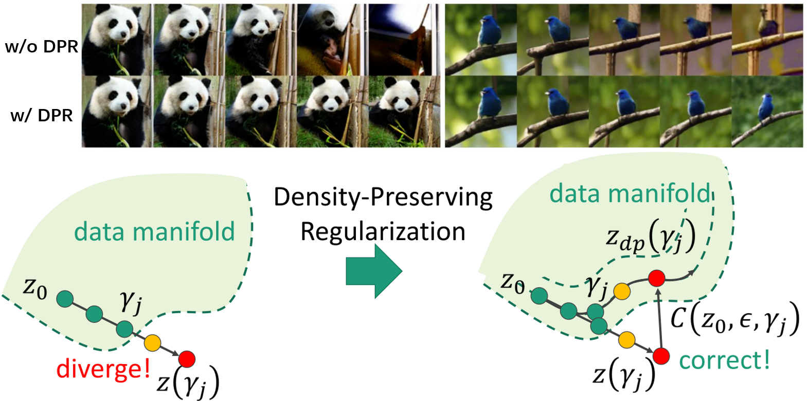

When I was tackling traversing in the latent space of generator, I was haunted by the identity shift in which you cannot well preserve the identity of the synthesized face images. Then I try to dig into this phenomenon. 

Problem Description
======
Traversing in pre-trained generator has great potential in real life applications, such as image editing, attribute manipulation, and so on. Given a datapoint $z$ in the latent space and a traversing direction $d$, we can change the datapoint $z$ along the direction $d$ with a stride $\epsilon$ as follows: 

$$z_m = z + \epsilon d. \tag{1}$$

if the resulting datapoint reflects some attributes, for example, adding glasses to a face, change the length of the hair, etc, then we can say the direction is meaningful. How to find these directions remains open problems. 

In our model DP-LaSE, we hypothesize that meaningful directions results in maximum variations in the intermediate layer. Let me put it in this way: Imagine a extreme situation where a direction that results in no changes in the intermediate layer, and then this direction cannot be meaningful direction because it's naive solution. Some works such as [$MCR^2$](https://book-wright-ma.github.io/) proposed that dataset can be spaned by several independent subspace that maximizes the coding rate. We believe that meaningful direction should results in largest variation so that the directions can expressed the dataset efficiently. 

Secondly, once the directions are found, it remains unsolved in how to traverse in the latent sapce. Many research such [SeFA]() and [UDUI]() traverses latent space by linear interpolation. But there is a issue of this --- large stride causes interpolation path to diverge from the data manifold. As is shown in Figure 1, increasing stride generally leads the interpolation path to diverge from the data manifold. 

    
     
    

    Figure 1. Large stride cause the traverse path diverge from the data manifold.  
    

A datapoint that is out of data manifold usually abnormal, because it's hardly trained in the training phrase since it's in low probability density area. On the contrary, a datapoint in the high probability density area are frequently trained, so the generation by datapoints there interweaves many attributes even by a small disturbance. We validate the hypothesis in the BigGAN and WGAN, and the results are shown in Figure 2. The pattern can be summarized as follows: 

+ Moving to higher probability density can cause dramatic change of the image, such as label and background.
+ Moving to lower probability density would fade out. 
+ Moving in the region of same probability density can results in reasonable changes. 

    
     
    

    Figure 2. Comparison of path that moves to higher (top), lower (bottom) and same density regions (middle).  
    

Our Implementation
======
Let's dive deeper on the implementation. 

Experiments
======
We demonstrate some directions in BigGAN and StyleGAN. For dog in BigGAN, we mainly found some directions that cause position change, like left-right, zoom in-out and up-down. For human face in StyleGAN, various directions are found. If the intermediate layer we set to optimize the maximum variation is close to the input, the attribution we found are age, gender, etc. Otherwise, attributes like glasses and bear can be found. 
<table>
    <tr>
        <td>
            

            
             
            

            (a) Left-right
            

            

        </td>
        <td>
            

            
             
            

            (b) Zoom in - out
            

            

        </td>
        <td>
            

            
             
            

            (c) Up - down
            

            

        </td>
    </tr>
</table>

    Figure x. Some of the directions in BigGAN. 
    

<table>
    <tr>
        <td>
            

            
             
            

            (a) Bear
            

            

        </td>
        <td>
            

            
             
            

            (b) Hair
            

            

        </td>
        <td>
            

            
             
            

            (d) Gender
            

            

        </td>
        <td>
            

            
             
            

            (c) Glasses
            

            

        </td>
    </tr>
</table>

    Figure x. Some of the directions in PGGAN. 
    

Reference 
=====

[Download paper here](https://1drv.ms/b/s!AqN-jN9xngyFohsv5_4BvANJPMcG)